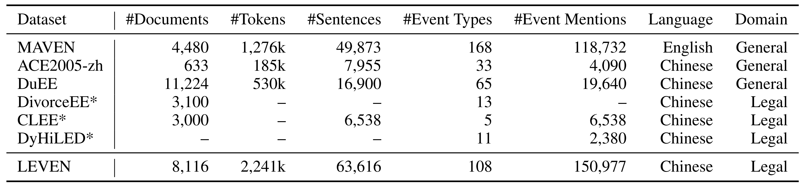
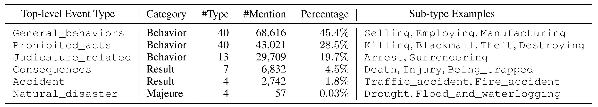
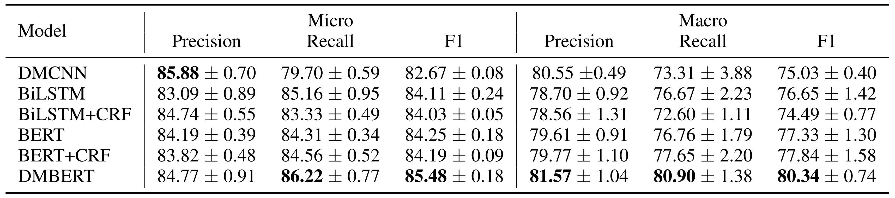
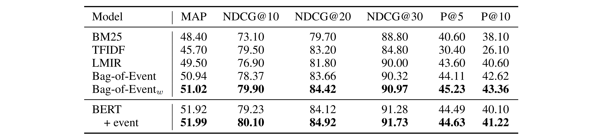
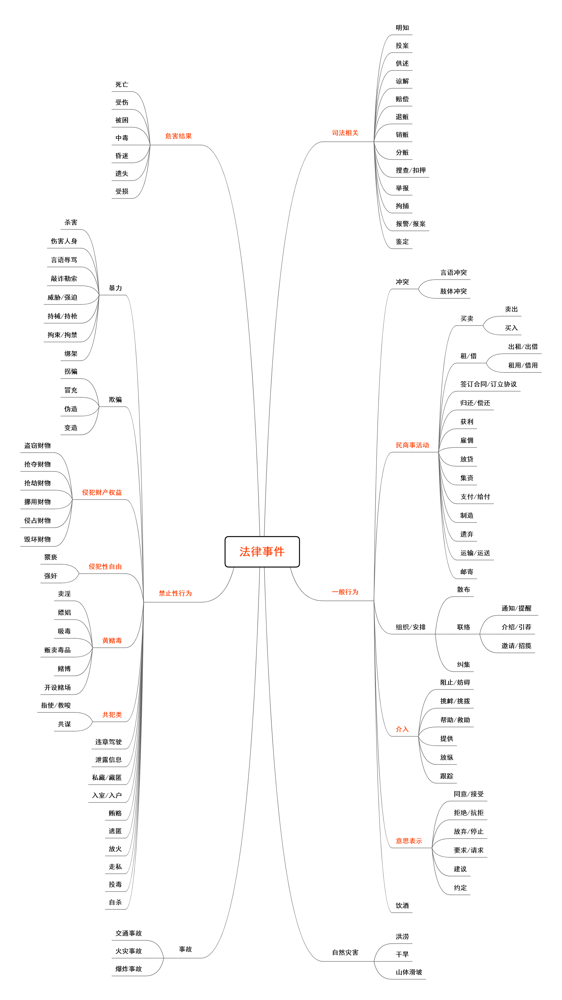

# LEVEN
Dataset and source code for ACL 2022 Findings paper ["LEVEN: A Large-Scale Chinese Legal Event Detection Dataset" ](https://aclanthology.org/2022.findings-acl.17.pdf).

## Overview

The dataset can be obtained from [Tsinghua Cloud](https://cloud.tsinghua.edu.cn/d/6e911ff1286d47db8016/) or [Google Drive](https://drive.google.com/drive/folders/1VGD0h365kegTqGEyLr24SJtJUUoZIt20?usp=sharing). The annotation guidelines are provided in [Annotation Guidelines](./Annotation-Guidelines). 
You can also check out our [poster](./poster/LEVEN-poster.pdf) at ACL2022 main conference.

### Large Scale

LEVEN is the largest Legal Event Detection dataset and the largest Chinese Event Detection dataset. Here is a comparison between the scale of LEVEN and other datasets. 



Datasets denoted with * are not publicly available, and – means the value is not accessible

### High Coverage

LEVEN contains 108 event types in total, including 64 charge-oriented events and 44 general events. Their distribution is shown below.



The LEVEN event schema has a sophisticated hierarchical structure, which is shown [here](#Schema).  

## Leader Board

LEVEN is going to appear at CAIL 2022. To get the test results, you can submit your predictions to [CAIL](http://cail.cipsc.org.cn/) (the specific submission entry is coming soon).


## Experiments

The source codes for the experiments are included in the [Baselines](./Baselines) and [Downstreams](./Downstreams) folder.

​	The Baselines folder includes [DMCNN](./Baselines/DMCNN), [BiLSTM](./Baselines/BiLSTM), [BiLSTM+CRF](./Baselines/BiLSTM+CRF), [BERT](./Baselines/BERT), [BERT+CRF](./Baselines/BERT+CRF) and [DMBERT](./Baselines/DMBERT).

​	The Downstreams folder includes [Legal Judgment Prediction](./Downstreams/LJP) and [Similar Case Retrieval](./Downstreams/SCR).

### Baselines

We implement six competitive [Baselines](./Baselines) and their performances are as follows.



### Downstream Tasks

We also explore the use of LEVEN on two [Downstreams](./Downstreams). We simply use event as side information to promote the performance of [Legal Judgment Prediction](./Downstreams/LJP) and [Similar Case Retrieval](./Downstreams/SCR). 

The experiment results for Legal Judgment Prediction are shown below.


The experiment results for Similar Case Retrieval are shown below.



## Schema

The Chinese event schema is shown below. Please check our paper for the English version.

The detailed explanation and annotation guidelines are provided in [Annotation Guidelines](./Annotation-Guidelines).



## Citation

If these data and codes help you, please cite this paper.
```bib
@inproceedings{yao-etal-2022-leven,
    title = "{LEVEN}: A Large-Scale {C}hinese Legal Event Detection Dataset",
    author = "Yao, Feng and Xiao, Chaojun and Wang, Xiaozhi and Liu, Zhiyuan and Hou, Lei and Tu, Cunchao and Li, Juanzi and Liu, Yun and Shen, Weixing and Sun, Maosong",
    booktitle = "Findings of the Association for Computational Linguistics: ACL 2022",
    year = "2022",
    url = "https://aclanthology.org/2022.findings-acl.17",
    doi = "10.18653/v1/2022.findings-acl.17",
    pages = "183--201",
}
```